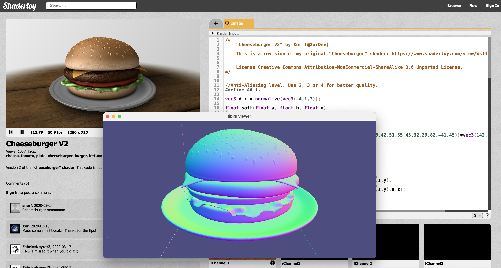

# Shadertoy Signed Distance Functions

This is a basic attempt to extract SDF functions from shadertoy examples like:

 - https://www.shadertoy.com/view/ld3Gz2
 - https://www.shadertoy.com/view/MsXGWr
 - https://www.shadertoy.com/view/WsXSDH

without modifying the glsl source much/at all.

To use this, grab the source code of http://www.shadertoy.com/view/MsXGWr and
save it in `cheeseburger-v2.h`. Comment out the `mainImage` function.

```bash
g++ main.cpp -std=c++17 -DNDEBUG -O3 -I ~/Repos/libigl/include
```

replace `~/Repos/libigl/include` with the path to your libigl include directory.

Then run with something like:

```bash
./a.out 
```

which will produce an `output.obj` file of a marching cubes mesh of the zero
level set.



Have a peek in `main.cpp` to see that it's easy to access the SDF function
without requiring libigl (that's just for the grid creation, marching cubes, and
file writing).

The `glsl.h` (an impoverished implementation of glsl using C++) is _just barely_
complete enough to run the two shaders above. It's likely going to be missing
functionality for other shaders. It's also purposefully not handling
lighting/textures.

The shadertoy examples linked above are copyrighted by Inigo Quilez. As per
instruction, their contents are not included here.


